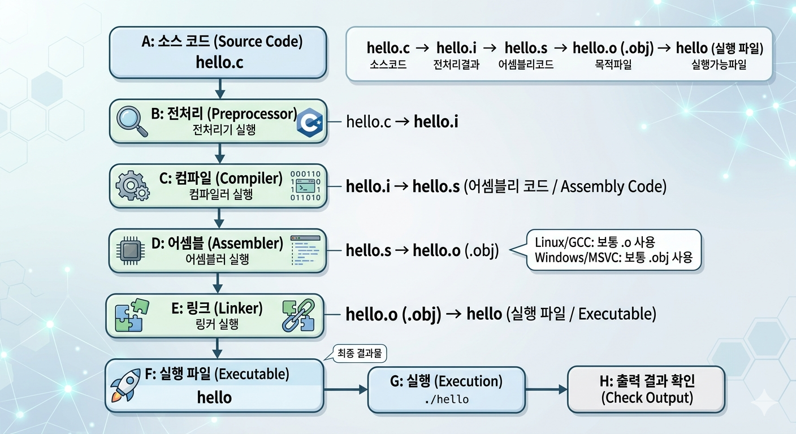

# 1. C 프로그램

[처음 안내 페이지로 돌아가기](../../README.md)

이 문서는 C 언어를 처음 배우는 분을 위해, 가장 기본이 되는 C 프로그램의 구조와 컴파일/실행 과정을 짧고 명확하게 정리한 자료입니다.

---

## 🎯 이 문서에서 배우는 것

이 문서를 끝내면 아래 3가지를 할 수 있습니다.

- C 프로그램의 최소 구조를 설명할 수 있습니다.
- `main` 함수의 역할을 설명할 수 있습니다.
- `gcc`로 컴파일하고 실행 파일을 실행할 수 있습니다.

학습을 시작하기 전에 개발 환경 설정 문서를 먼저 완료해 주세요.

---

## 1. 프로그램이란 무엇인가

먼저 **프로그램**이 무엇인지부터 간단히 이해해 봅시다.

- 프로그램은 컴퓨터가 해야 할 일을 순서대로 적어 둔 "명령의 묶음"입니다.
- 예를 들어 계산기 앱, 메모장, 게임도 모두 프로그램입니다.
- 프로그램은 입력을 받아 처리하고, 결과를 출력하는 방식으로 동작합니다.
- 화면에 글자를 보여 주거나, 계산 결과를 알려 주는 것도 프로그램의 동작 결과입니다.

---

## 2. C 프로그램의 동작 방식

아래 그림은 C 소스 코드가 전처리부터 링크, 실행까지 어떤 흐름으로 처리되는지 한눈에 보여줍니다.



### 1. 전처리 (Preprocessor)

- `#include`, `#define`, `#if` 같은 전처리 지시문을 먼저 처리합니다.
- 예를 들어 `#include <stdio.h>`는 실제 헤더 내용이 필요한 형태로 반영됩니다.
- 이 단계 결과는 전처리된 소스 파일입니다.
- 아래 명령은 `hello.c`를 전처리해서 `hello.i` 파일로 저장하는 예시입니다.

```bash
gcc -E hello.c -o hello.i
```

### 2. 컴파일 (Compiler)

- 전처리된 코드를 분석해 문법 오류를 검사합니다.
- 문제가 없으면 C 코드를 어셈블리 코드(저수준 코드)로 바꿉니다.
- 아래 명령은 전처리 결과(`hello.i`)를 컴파일해 어셈블리 파일(`hello.s`)을 만드는 예시입니다.

```bash
gcc -S hello.i -o hello.s
```

### 3. 어셈블 (Assembler)

- 어셈블리 코드를 기계어에 가까운 목적 파일(Object file)로 변환합니다.
- Linux/GCC 환경에서는 보통 `.o`, Windows/MSVC 환경에서는 `.obj` 확장자를 많이 사용합니다.
- 목적 파일은 아직 바로 실행할 수는 없습니다.
- 아래 명령은 어셈블리 파일(`hello.s`)을 목적 파일(`hello.o`)로 만드는 예시입니다.

```bash
gcc -c hello.s -o hello.o
```

### 4. 링크 (Linker)

- 목적 파일과 필요한 라이브러리를 연결해 최종 실행 파일을 만듭니다.
- `printf` 같은 함수도 이 단계에서 실제 구현과 연결됩니다.
- 하나의 프로젝트에서는 여러 개의 `.o`(또는 `.obj`) 파일을 함께 링크하기도 합니다.
- 아래 명령은 목적 파일(`hello.o`)을 링크해 실행 파일(`hello`)을 만드는 예시입니다.

```bash
gcc hello.o -o hello
```

### 5. 실행 (Run)

- `./hello`를 실행하면 운영체제가 실행 파일을 메모리에 올리고 `main` 함수부터 실행합니다.
- 실행 결과로 화면에 `Hello, World!`가 출력됩니다.

한 번에 실행 파일까지 만들고 싶다면, 아래처럼 전처리, 컴파일, 어셈블, 링크 단계를 묶어 실행할 수 있습니다.

```bash
gcc hello.c -o hello
```

---

## 3. 첫 코드 작성: Hello, World!

### 1. 프로젝트 만들기

프로젝트 생성과 폴더 준비는 아래 문서를 먼저 참고해 진행해 주세요.

- [Visual Studio Code로 C 언어 프로젝트 만들기](../guides/vscode-c-project-setup.md)

프로젝트를 연 뒤 같은 폴더에서 아래 단계를 이어서 진행합니다.

### 2. 코드 작성

`hello.c` 파일을 만들고 아래 코드를 입력하세요.

```c
#include <stdio.h>

int main(void) {
    printf("Hello, World!\n");
    return 0;
}
```

처음에는 코드를 그대로 따라 입력하는 것이 가장 좋습니다.

- 대소문자를 정확히 맞춥니다.
- 세미콜론(`;`)을 빠뜨리지 않습니다.
- 따옴표(`"`)와 괄호를 정확히 입력합니다.

### 3. 코드에 대한 설명

- `#include <stdio.h>`: 화면 출력 함수(`printf`)를 사용하기 위해 필요한 헤더를 포함합니다.
- `int main(void)`: 프로그램이 시작되는 함수입니다.
- `printf("Hello, World!\n");`: 화면에 문자열을 출력하고 줄을 바꿉니다.
- `return 0;`: 프로그램이 정상적으로 끝났다는 상태를 운영체제에 전달합니다.

### 4. 코드 실행

아래 명령으로 컴파일한 뒤 실행합니다.

```bash
gcc hello.c -o hello
./hello
```

정상이라면 아래처럼 출력됩니다.

```text
Hello, World!
```
